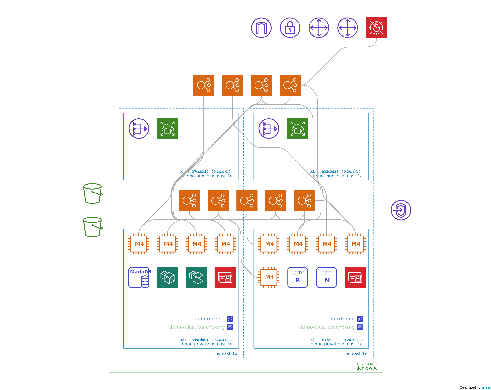

# Hava sync action example

This repo is an example of the hava sync action. It will generate a diagram using Hava, which can be commited to your repository and linked in markdown files like in this readme.

See the [github workflow](.github/workflows/deploy.yml) for details on how it has been implemented for this repository

Details the of the action is in the [hava-sync-action](https://github.com/teamhava/hava-sync-action) repo

## Generated architecture diagram

